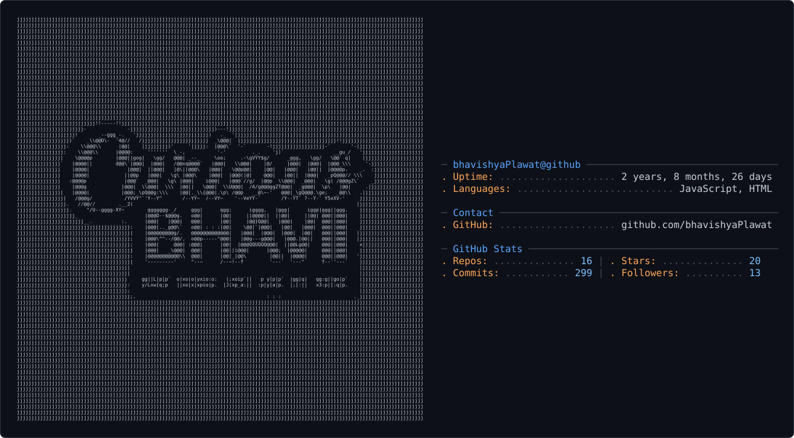

 

  
 ### _"My name means 'Future', and I'm building it."_
  <h1>Bhavishya Plawat</h1>

<picture>
  <source media="(prefers-color-scheme: dark)" srcset="dark_mode.svg" />
  <source media="(prefers-color-scheme: light)" srcset="light_mode.svg" />
  
</picture>
  
  

    
    
    
  

---

### 🚀 About Me
- 👨‍💻 &nbsp; Full-stack developer specializing in the MERN stack.
- 💡 &nbsp; Passionate about building clean, efficient, and user-centric web applications.
- 🤝 &nbsp; Open to collaborating on innovative projects and startups.
- ✨ &nbsp; Fun Fact: Cleared the rigorous **SSB (Services Selection Board) interview** on the first attempt, demonstrating strong leadership and problem-solving skills.
- 📫 &nbsp; You can reach out to me at: **tobhavishya2004@gmail.com**

---

### 🛠️ My Tech Stack
<table align="center">
  <tr>
    <td align="center" width="120">
      
       React
    </td>
    <td align="center" width="120">
      
       Node.js
    </td>
    <td align="center" width="120">
     
       Express
    </td>
    <td align="center" width="120">
      
       MongoDB
    </td>
  </tr>
  <tr>
    <td align="center" width="120">
      
       JavaScript
    </td>
    <td align="center" width="120">
      
       HTML5
    </td>
    <td align="center" width="120">
      
       CSS3
    </td>
    <td align="center" width="120">
     
       Tailwind CSS
    </td>
  </tr>
</table>

---

### 📊 GitHub Statistics

  
  
   

---

### 🏆 GitHub Trophies

  

